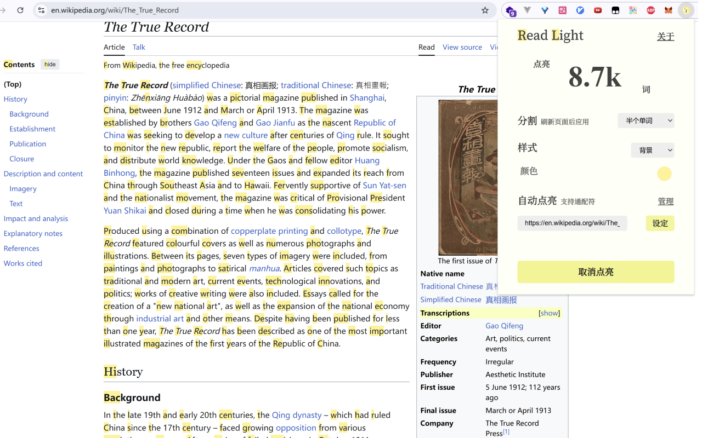
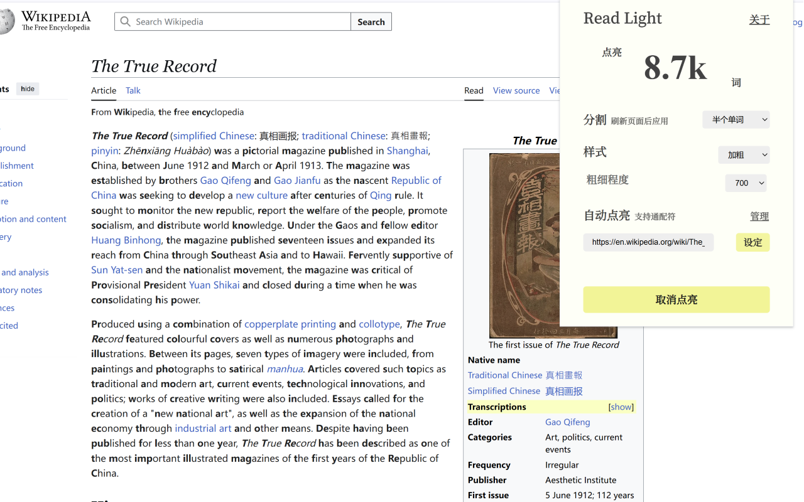

 

Highlight Read

方便非英语母语者快速阅读

## ❓原理
为每个单词进行视觉上的标记，以便于进行快速阅读时定位单词.
## 📷使用截图

## 开源许可

本项目使用了以下开源组件，这些组件均采用 MIT 许可证：

- copy-webpack-plugin
- css-loader
- file-loader
- mini-css-extract-plugin
- size-plugin
- webpack
- webpack-cli
- webpack-merge
- @types/chrome
- compromise
- compromise-speech
- wildcard-match

本项目采用[GPL协议](https://www.gnu.org/licenses/gpl-3.0.html).